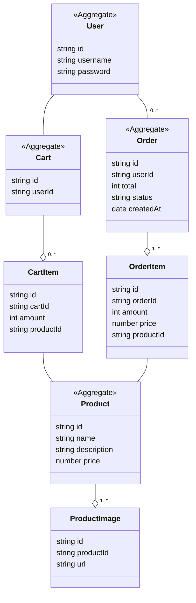

# Domain

```mermaid
classDiagram
class User {
  <<Aggregate>>
  string id
  string username
  string password
}

class Product {
  <<Aggregate>>
  string id
  string name
  string description
  number price
}

class ProductImage {
  string id
  string productId
  string url
}

class Cart {
  <<Aggregate>>
  string id
  string userId
}

class CartItem {
  string id
  string cartId
  int amount
  string productId
}

class Order {
  <<Aggregate>>
  string id
  string userId
  int total
  string status
  date createdAt
}

class OrderItem {
  string id
  string orderId
  int amount
  number price
  string productId
}

User -- Cart
User -- "0..*" Order
Product --o "1..*" ProductImage
Cart --o "0..*" CartItem
CartItem -- Product
Order --o "1..*" OrderItem
OrderItem -- Product
```
